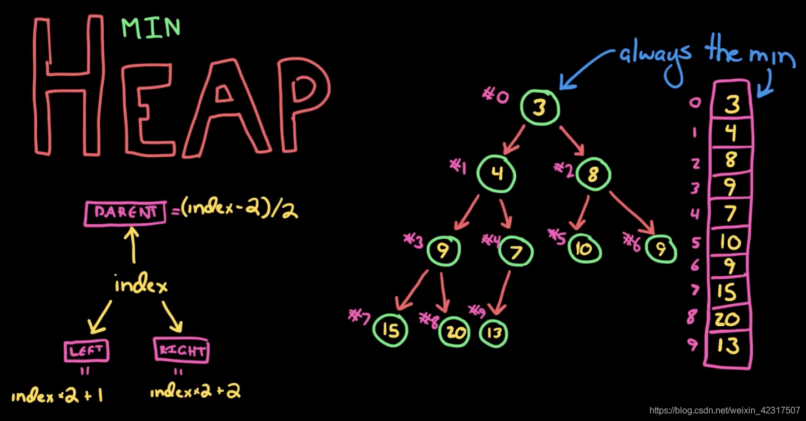
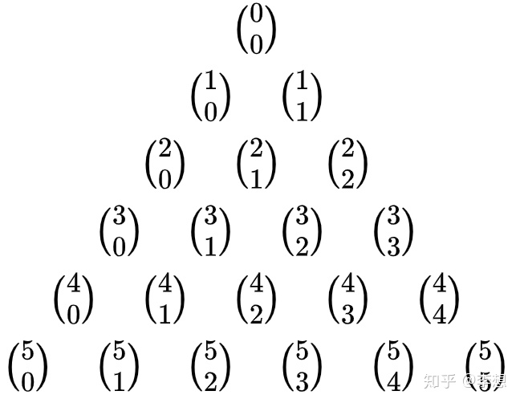
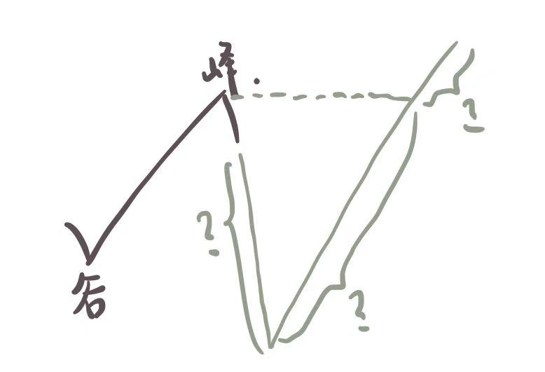

# Leetcode-Problem-Set

### [976. 三角形的最大周长(S)](https://leetcode-cn.com/problems/largest-perimeter-triangle/)：[Code](https://github.com/LobbyBoy-Dray/Leetcode-Problem-Set/blob/master/code/0976-简单-三角形的最大周长.py)

> "难的又不会，只能做做简单题混混每日打卡这样子"‘

上来就想用递归，然后想用排序+DP——dp[i]表示以A[i]为最长边的可行三角形的最大周长。但紧接着就发现状态转移方程写不出来，或者说根本不需要状态转移……因为A[i-2]和A[i-1]如果不能和A[i]构成三角形的话，那更前面的A[i-k]就更不行了（可行三角形的充要条件：两条较短边之和大于最长的一边），所以排序后单指针遍历即可。

**Note**：一开始用从前往后遍历，发现只击败了10%+；看评论才意识到从后遍历这种贪心做法更快，还是太naive了……

### [767. 重构字符串(M)](https://leetcode-cn.com/problems/reorganize-string/)：[Code](https://github.com/LobbyBoy-Dray/Leetcode-Problem-Set/blob/master/code/0767-中等-重构字符串.py)

> "为什么方法一图里有一个醒目的 sb？仿佛在人身攻击我(;´༎ຶД༎ຶ`)"

把出现次数最多的字母X挑出来，用剩下的字母来插空。

* 插空之前，如果字符串总长度小于【2×X出现次数-1】，那么肯定不能构建出满足题意的目标字符串——例如aaaabb，两个其他字符不够插三个空的，所以必有两个a连在一起；
* 如果过了上面的条件判断，那么一定可以构建出目标字符串的，构建方法：用【其他字符】开始插空，插完一轮后继续插，直到用完所有其他字符——例如：aaaabbccc
  * aaaa
  * abaaa（插一个b）
  * ababaa（再插一个b，b用完）
  * ababaca（插一个c）
  * ababacac（再插一个c，此时一轮插完，从头再插）
  * acbabacac（所有其他字符插完，结束）
* Why上面的插法不会有相邻字符是一样的？如果有相邻字符是一样的，那意味着，有一个字符出现了很多次，以至于它插完了所有的空又轮了回来——但我们知道空的数量等于出现最多的字符出现的次数，所以不会再有字符出现比这个更多次了，所以不会出现上述情况。

**Note**：挖个坑，官方题解以及其他coder都说用“最大堆”很巧妙，明后天抽空学一下。

### [34. 在排序数组中查找元素的第一个和最后一个位置(M)](https://leetcode-cn.com/problems/find-first-and-last-position-of-element-in-sorted-array/)：[Code](https://github.com/LobbyBoy-Dray/Leetcode-Problem-Set/blob/master/code/0034-中等-在排序数组中查找元素的第一个和最后一个位置.py)

>"今天终于可以重拳出击了。"

主要使用的方法还是二分查找：

* 首先，用二分法找到第一个target所在位置loc——如果连第一个都找不到的话，说明数组中就没有这个target，返回[-1,-1]即可；接着，对nums[:loc+1]和nums[loc:]两个数组分别再用二分，分别找最左侧和最右侧的target——一定能找到，因为再不济nums[loc]就是target；
* 怎么找最左侧的target？二分，如果nums[mid]等于target，暂存mid并令end=mid-1，即最左侧的target（如果存在）肯定还在左边子数组里；如果nums[mid]小于target，则令start=mid+1；不可能是nums[mid]大于target，因为原数组本来就是升序的。直到找完整个数组即可。最右侧的target找法类似。

### [321. 拼接最大数(H)](https://leetcode-cn.com/problems/create-maximum-number/)：[Code](https://github.com/LobbyBoy-Dray/Leetcode-Problem-Set/blob/master/code/0321-困难-拼接最大数.py)

> "Computer Vision 计算机视觉，人工智能领域之一，简称CV，在该领域中的一切问题都可以通过：第一步：人工(按住键盘左下角那个键的同时，按住C)；第二步：智能，需要靠你大脑中亿万神经元的协同合作才能完成，你需要在屏幕中精确的选好位置，然后按下最下角那个键+V。这两步缺一不可！"

大的逻辑是：

* 将k分解为i+j，表示其中i个来自num1，j个来自num2——遍历所有available的(i,j)，获得最大的结果；
* 对于一个(i,j)：
  * ①从num1中拿到长度为i的最大数；从num2中拿到长度为j的最大数；
  * ②合并成一个数

其中，①步骤用DP做了大半天，但怎么调都超时（DP代码以注释形式保留）。看了题解，用单调栈通过。什么是单调栈：

* 在“还有名额”时，维持栈内的元素自底向顶是单调的；
* 本题中，在还可以删除元素时，向栈顶添加元素前，若栈顶的元素小，则弹出，直到：
  * 栈空了，弹不了了；OR
  * 删除的太多，已经没有删除名额了；OR
  * 栈顶的元素大于或等于要添加元素。
* 为什么栈顶元素小就要弹出：因为栈中一个元素，就对应着结果中的一位——栈顶小，那当然要用大的值来取代它了——一直弹，也就是把更大的数往高位去顶

### [204. 计数质数(S)](https://leetcode-cn.com/problems/count-primes/)：[Code](https://github.com/LobbyBoy-Dray/Leetcode-Problem-Set/blob/master/code/0204-简单-计数质数.py)

> "写排名第一的那个答案的真他娘的是个人才，把特么20个测试用例全部写进去了。牛逼。"

正好之前在一本算法书的序言章节中看到过【埃氏筛法】的介绍，举个例子：

* 2 3 4 5 6 7 8 9 10 11 12 13 14 15
* 筛掉2的倍数(自己不筛): 2 3 5 7 9 11 13 15
* 筛掉3的倍数(自己不筛): 2 3 5 7 11 13——这里不用从2×3开始找，直接从3×3=9开始即可，因为2×3的那个数会被2的时候筛掉——筛p的倍数(自己不筛)，从p×p开始即可，p×(p+1)、p×(p+2)……
* 筛掉4的倍数(自己不筛)：2 3 5 7 11 13——不用，因为第一个要筛的为4*4=16，已经大于15了，算法停止。

### [659. 分割数组为连续子序列(M)](https://leetcode-cn.com/problems/split-array-into-consecutive-subsequences/)：[Code](https://github.com/LobbyBoy-Dray/Leetcode-Problem-Set/blob/master/code/0659-中等-分割数组为连续子序列.py)

> "你们都在答题，只有我想斗地主"

核心：建立一个哈希表，key是数字，value是二叉堆（binaryheap）。

* 数字就是待一会儿要遍历数组，数组的每个数字就是那个key；
* 二叉堆表示的是，以key这个数字结尾的、所有连续子序列的长度，构建方法如下：
  * 如果存在以（key-1）这个数字结尾的连续子序列的话，取其中最短的那个长度加上1添加到该key的堆中，同时注意把（key-1）堆中相应的那个最短的长度删掉——这也是为啥选择用二叉堆这个数据结构（优先队列）——Note：这是一种贪心做法，用掉当前数字且尽量增长前面的短的子序列——那为啥不留下当前数字和后面的数字组序列？万一前面用太快后面的数字没得用了？——如果前面有可以续上的子序列而不续的话：情形一，后面的数字能和该数字续上，那还不如和当前数字一起续到前面短序列上；情形二，后面的数字和该数字续不上，那该数字就落单了。
  * 如果不存在以（key-1）这个数字结尾的连续子序列的话，那只能以改数字为开头做子序列，也就是给改数字的二叉堆添加一个1，表示加一个长度为1的子序列，等待看后面的数字能不能续上。
* 最后，遍历一遍哈希表，如果有哪个不为空的二叉堆的最小值小于3，那就说明拆解失败。

**Note**：二叉堆=完全二叉树+堆次序，本题用的最小堆，即root最小。

### [621. 任务调度器(M)](https://leetcode-cn.com/problems/task-scheduler/)：[Code](https://github.com/LobbyBoy-Dray/Leetcode-Problem-Set/blob/master/code/0621-中等-任务调度器.py)

>"可以将难度评价员开除了吗？？这是中等？？？明显是难为我胖某人"

我们首先建立一个哈希表，key是字母，value是出现次数。这里我们特别注意“出现最多的次数“以及”相应的字母“。以n=2为例，我们假设”出现最多的次数“为3，其”相应的字母“里有一个是A，我们一定会这样来画任务序列的草图：

* A - - A - - A —— 因为任务之间必须要有n个等待时间，而A出现最多，所以把时间拉得最长。

如果有多个字母出现3次呢？比如还有1个B，那么这样：

* A B - A B - A B —— 我们发现还有空位置
  * 如果空位置数量 > 剩下任务数，那最终的任务序列长度就是这么长（这里是8）——空位置之间的距离等于n，所以插进去没事；
  * 如果空位置数量 < 剩下的任务数，那么插完空位置后，还要从头开始插，不过后面的字母因为出现次数少，所以不会出现两个挨得太近——此时任务序列长度就等于task长度——紧密的；

如果还有C和D呢？也就是“n<出现最多次的字母数量-1”，这里是2<4-1：

* A B C A B C A B C —— D怎么填？当然是直接填了：
  * A B C D A B C D A B C D
  * 填完后，剩下的任务，也是从头开始插——此时任务序列长度就等于task长度——紧密的；

这样规律就出来了。

### [118. 杨辉三角(S)](https://leetcode-cn.com/problems/pascals-triangle/)：[Code](https://github.com/LobbyBoy-Dray/Leetcode-Problem-Set/blob/master/code/0118-简单-杨辉三角.py)

> "困难题我唯唯诺诺，简单题我重拳出击"

递归。

**Note**：(a+b)^n的二项式展开中的各项系数依次对应杨辉三角的第n行中的每一项（行号从第0行开始）。

### [861. 翻转矩阵后的得分(M)](https://leetcode-cn.com/problems/score-after-flipping-matrix/)：[Code](https://github.com/LobbyBoy-Dray/Leetcode-Problem-Set/blob/master/code/0861-中等-翻转矩阵后的得分.py)

> "这个月是贪心月，对于我这种大公无私的人来说，着实有些困难"

贪心：①最高位是1最好；②其他位1越多越好。

首先，每行的第0个数肯定都要翻转成1，不然肯定不是最大——这样第一波翻转后，第0列就全都是1了；

* 例如：0110-1010-0011，要翻成1001-1010-1100

其次，再看除第0列的其他列——每列一定要翻转成1占一半或以上，否则肯定不是最大。

* 例如某一列是1-0-0-0-1，贡献为2×2^n；要翻成0-1-1-1-0，这样贡献为3×2^n，更多。

### [842. 将数组拆分成斐波那契序列(M)](https://leetcode-cn.com/problems/split-array-into-fibonacci-sequence/)：[Code](https://github.com/LobbyBoy-Dray/Leetcode-Problem-Set/blob/master/code/0842-中等-将数组拆分成斐波那契序列.py)

> "我啪一下就的点进来了，很快啊，我就退出了"

（赶着睡觉写的实在太丑陋了，但复杂度竟然过了，虽然只击败20%左右……）

迭代：输入是【第一个string】、【第二个string】以及剩下的字符串，输出要么是False——表明无法拆成斐波那契序列，要么是一个斐波那契序列。写的过程中注意两点：

* 第一，任何数项不能以0开头，除非就是0本身；
* 第二，数项要小于等于2^31 - 1！这一点很重要，因为有个测试例子是"539834657215398346785398346991079669377161950407626991734534318677529701785098211336528511"——虽然可以拆成斐波那契序列，但其中有的数项溢出了。

**Flag：学习一下标准的回溯算法。**

### [62. 不同路径(M)](https://leetcode-cn.com/problems/unique-paths/)：[Code](https://github.com/LobbyBoy-Dray/Leetcode-Problem-Set/blob/master/code/0062-中等-不同路径.py)

> "数学大法好"

一道非常典型的DP问题，列出状态转移方程就结束了。

*但复杂度更低的方法是直接用组合数学：“从左上角到右下角的过程中，我们需要移动m+n-2次，其中有m−1次向下移动，n-1次向右移动。因此路径的总数，就等于从m+n−2次移动中选择m−1次向下移动的方案数，即组合数……*——From [官方题解](https://leetcode-cn.com/problems/unique-paths/solution/bu-tong-lu-jing-by-leetcode-solution-hzjf/)

### [860. 柠檬水找零(S)](https://leetcode-cn.com/problems/lemonade-change/)：[Code](https://github.com/LobbyBoy-Dray/Leetcode-Problem-Set/blob/master/code/0860-简单-柠檬水找零.py)

> "还搁这儿现金呢，现在都微信支付宝了"

遍历账单数组模拟即可。只需注意一点：当收到20元时，优先用10块找零（10+5）；如果10块无法完成的话，再check用三张5块找零。

### [649. Dota2 参议院(M)](https://leetcode-cn.com/problems/dota2-senate/)：[Code](https://github.com/LobbyBoy-Dray/Leetcode-Problem-Set/blob/master/code/0649-中等-Dota2参议院.py)

> "为了理解题意，我去打一局dota不过分吧"

**贪心**：对于某一个人，一定是先禁【自己后面】最靠近自己的异方阵营——如果后面全是己方阵营，那么先禁【自己前面】最开头的异方阵营——如果没得可禁，则可以宣布胜利。

用两个队列来做：ra队列用Radiant的index初始化，di队列用Dire的index初始化；不断pop两个队列的队首作比较，大的那方会被小的那方禁掉（根据前面说的贪心规则），因此永久出队，而小的那方还将继续留在队列中——加上原senate总长度后重新从队尾入队——相当于①出队位置变成了None，②小的那方变成了下一轮，可供后面的异方阵营来禁。

最后哪个队列先变空，另一个队列那一方获胜。

例子：DRRRD

1. D\_RRD（0D禁掉了1R，0D变5D）
2. D\_RR\_（2R禁掉了4D，2R变7R）
3. \_\_RR\_（3R禁掉了5D，3R变8R）
4. 全剩R，R方获胜

### [376. 摆动序列(M)](https://leetcode-cn.com/problems/wiggle-subsequence/)：[Code](https://github.com/LobbyBoy-Dray/Leetcode-Problem-Set/blob/master/code/0376-中等-摆动序列.py)

> "很快呀, 啪的一下, 我来了, 然后我又走了"

摆动序列要求差值数组是一正一负或一负一正这种正负交替的pattern。例如，数组[1,17,5,10,13,15,10,5,16,8]，其差值数组是[16, -12, 5, 3, 2, -5, -5, 11, -8]，并不是正负交替，因此整个数组并不是摆动序列，需要删掉一部分元素后才能变成摆动序列。

删一个数，反映在差值数组中，就是将某两个相邻数字加和。例如，删掉index=1的17，差值数组变成[4, 5, 3, 2, -5, -5, 11, -8]，即16-12=4。因此，我们可以将问题转化成：如何操作差值数组，使其变成最长的正负交替序列——其中的“操作”是指，将几个连续的数字加起来。

一个很容易想到的策略是贪心策略，即将某数和其之后连续的同号数相加合并成一个。如上面的差值数组为[16, -12, 5, 3, 2, -5, -5, 11, -8]，贪心做法后得到的差值数组为[16, -12, 10, -10, 11, -8]。但是这种贪心策略的结果是最优的吗？会不会有别的方法，使得得到的差值数组比贪心来的更长？我们可以这样想：对于差值数组中的一个”连续同号序列“，我们要么按照贪心做法将它们加在一起合并成一个数，要么保留其中1个，剩下的左右两边分别去和其他数字合并。举个例子：差值数组中有一个连续同号序列——[..., 5, 7, 8, ...]，贪心策略是3个数变1个数：”3→1“；而非贪心策略，假设保留7，那么5至少和其左侧1个合并，8至少和其右侧1个合并，那么至少是4个数变2个数：“4→2”；如果合并再多，即“5→2”、“6→2”……那数组长度就不是最长了。比较”3→1“和“4→2”，发现贪心能够100%得到的数组最长。

### [217. 存在重复元素(S)](https://leetcode-cn.com/problems/contains-duplicate/)：[Code](https://github.com/LobbyBoy-Dray/Leetcode-Problem-Set/blob/master/code/0217-简单-存在重复元素.py)

> "看到真的简单题，我又激昂起来了"

创建一个空字典，主要是利用字典查找key的时间复杂度为O(1)这个特点。遍历数组（临时变量为i），如果i在字典的key中，则说明有重复元素，此时可立刻返回True；如果i不在字典的key中，那么添加进去——这里value是什么随意，并不重要。

### [49. 字母异位词分组(M)](https://leetcode-cn.com/problems/group-anagrams/)：[Code](https://github.com/LobbyBoy-Dray/Leetcode-Problem-Set/blob/master/code/0049-中等-字母异位词分组.py)

> "太蠢了自己，双重for，一顿操作猛如虎，一看战绩百分五"

用【排序后的字符串】作为字典的键即可！

### [738. 单调递增的数字(M)](https://leetcode-cn.com/problems/monotone-increasing-digits/)：[Code](https://github.com/LobbyBoy-Dray/Leetcode-Problem-Set/blob/master/code/0049-中等-字母异位词分组.py)

> "写题解的人是不打算让人看懂么"

（拿笔画一画就画出了下面的思路）

遍历，找到第一个与最高位（记作X）不一样的数字（Y，索引记作idx）——找不到的话说明该数所有数字一样，返回即可：

* 若X>Y：最高位减掉1，其他位莽9即可；
* 若X<Y：规模更小子问题——list[idx:]

### [121. 买卖股票的最佳时机(S)](https://leetcode-cn.com/problems/best-time-to-buy-and-sell-stock/)：[Code](https://github.com/LobbyBoy-Dray/Leetcode-Problem-Set/blob/master/code/0121-简单-买卖股票的最佳时机.py)

**动态规划**

* dp[i]表示“index=i那天卖出股票能赚得的最大收益”——Review：动态规划的两种常见状态构造
  * 迄index=i为止……
  * 以index=i结尾……
* 状态转移函数dp[i]：
  * 首先注意到：dp[i-1] = -min[i-1]+price[i-1]，其中min[i-1]表示至index=i-1这一天股价的最低值
  * → min[i-1]=price[i-1]-dp[i-1]
  * → min[i] = min(min[i-1], price[i])
  * → dp[i] = -min[i]+price[i]

**改进**

* 引入两个变量：min_price，记录迄今为止最低股价；max_profit，记录迄今为止最高利润；
* 遍历prices数组，对于每一天：
  * 先更新min_price：今天是不是历史最低价，是的话更新；
  * 然后更新max_profit：如果今天卖出股票，利润会不会更大（今天卖出的话，买入点就是历史最低价）。

### [122. 买卖股票的最佳时机 II(S)](https://leetcode-cn.com/problems/best-time-to-buy-and-sell-stock-ii/)：[Code](https://github.com/LobbyBoy-Dray/Leetcode-Problem-Set/blob/master/code/0122-简单-买卖股票的最佳时机2.py)

**动态规划**

* 每一天最后有两种状态：有股票，没股票

* dp\[i\]\[0\]表示index=i这一天最后没股票的状态下，最大利润；dp\[i\]\[1\]表示index=i这一天最后有股票的状态下，最大利润；
* dp\[i\]\[0\] = max(dp\[i-1\]\[0\]，dp\[i-1\][1]+prices[i])，今天没有股票，可能是：
  * 昨天也没有股票
  * 昨天有股票但今天卖掉了
* dp\[i\]\[1\] = max(dp\[i-1\]\[1\]，dp\[i-1\][0]-prices[i])，今天有股票，可能是：
  * 昨天有股票
  * 昨天没有股票但今天买入了

**贪心**

* 策略：谷入，峰出；
  * 谷：两边高，中间低；对于起点，右高；
  * 峰：两边低，中间高；对于重点，左低。

* 为何贪心策略可以得到最优？局部分析+反证法：入肯定是谷入，如果不是峰出，其他三段出的利润都不会有峰出高。

### [714. 买卖股票的最佳时机含手续费(M)](https://leetcode-cn.com/problems/best-time-to-buy-and-sell-stock-with-transaction-fee/)：[Code](https://github.com/LobbyBoy-Dray/Leetcode-Problem-Set/blob/master/code/0714-中等-买卖股票的最佳时机含手续费.py)

**动态规划**

* 与上一题极其类似，只需将卖出股票时多收一个手续费即可，即dp\[i\]\[0\]的转移方程变为：dp\[i\]\[0\] = max(dp\[i-1\]\[0\]，dp\[i-1\][1]+prices[i]-fee)

**贪心**

* 暂略（自己想不出来，解答又没看懂，摊手……）

### [389. 找不同(S)](https://leetcode-cn.com/problems/find-the-difference/)：[Code](https://github.com/LobbyBoy-Dray/Leetcode-Problem-Set/blob/master/code/0389-简单-找不同.py)

> "为什么大佬们总是能想到位操作,难道这就是差距吗"
>
> ——"因为我们在做专项练习题"

头铁，一上来就想到哈希表，还是太naive了。贴一下官方题解中的**位运算法**：

* 位运算符中的——异或，XOR，性质：
  * a XOR 0 = a
  * a XOR a = 0
  * 满足【交换律】和【结合律】
* 本题先将两个字符串拼在一起，然后找出现**奇数次**的字符！
  * 用ord函数将字符转换为整数
  * a XOR b …… = 0 XOR 目标字符 = 目标字符
  * 结束

### [48. 旋转图像(M)](https://leetcode-cn.com/problems/rotate-image/)：[Code](https://github.com/LobbyBoy-Dray/Leetcode-Problem-Set/blob/master/code/0048-中等-旋转图像.py)

> "我这次真的很快，啪一下就AC了。。。"

Step1：行对称操作——第一行与最后一行互换，第二行与倒数第二行互换……

Step2：转置——双层循环。

### [316. 去除重复字母(M)](https://leetcode-cn.com/problems/remove-duplicate-letters/)：[Code](https://github.com/LobbyBoy-Dray/Leetcode-Problem-Set/blob/master/code/0316-中等-去除重复字母.py)

> "压根没想到单调栈的我还有救吗，woshishabi"

单调栈经验值+1！但是自己还是想不出要用单调栈（但还是可以想到贪心的策略，就差一点……）
* 如果待添字符X0已经在栈中了（记栈中的那个相同的字符为X1），则放弃该待添元素X0——反证，如果放弃X1的话：X1的上层一定是大于X1的字符，不然早在前面的步骤里X1就被弹掉了，所以如果弹掉X1的话，补上去的是更大的字符，导致整个字符串变大——因此要舍弃X0。
* 如果待添字符X0不在栈中，同时满足以下条件不断弹出顶层字符：
	* 栈不为空
	* 栈顶字符的剩余数量大于0
	* 栈顶字符大于待添字符
综上，要维护两个数据结构，一个用来储存字符的剩余数量，另一个用来储存栈中的现有字符。

### [746. 使用最小花费爬楼梯(S)](https://leetcode-cn.com/problems/min-cost-climbing-stairs/)：[Code](https://github.com/LobbyBoy-Dray/Leetcode-Problem-Set/blob/master/code/0746-简单-使用最小花费爬楼梯.py)

> "我觉得这个题的描述应该改改：每个阶梯都有一定数量坨屎，一次只能跨一个或者两个阶梯，走到一个阶梯就要吃光上面的屎，问怎么走才能吃最少的屎？开局你选前两个阶梯的其中一个作为开头点，并吃光该阶梯的屎。"

标准的DP问题，状态转移函数的核心：到达阶梯i，可能从阶梯i-1跨一步，也可能从阶梯i-2跨两步。

当然也可以用递归+缓存来解决。